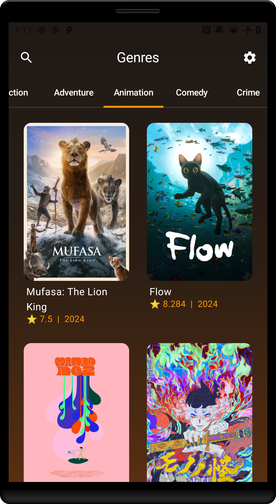

# Movie App | MVVM, Compose, Retrofit, Hilt

<table>
  <tr>
    <th>Android Preview</th>
  </tr>
  <tr>
    <td>
      
    </td>
  </tr>
</table>


## Overview
A basic clean architecure MVVM movie app for Android written in Kotlin. Jetpack Compose used for UI, Retrofit for API calls to TMBD.

#### Your API key must be added manually to `local.properties` file.

Inside `local.properties` add line:
```
TMDB_API_KEY=your-api-key
```
